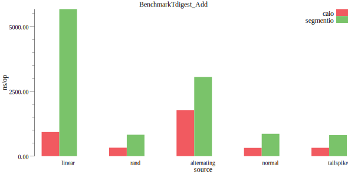
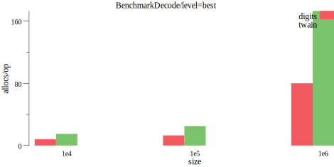
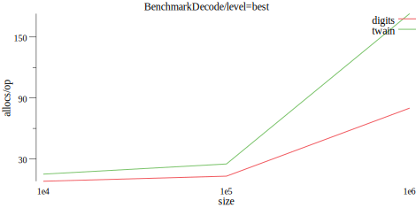
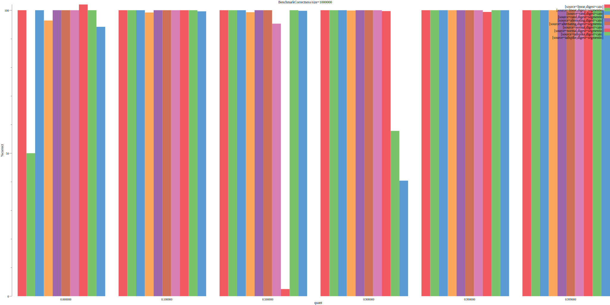
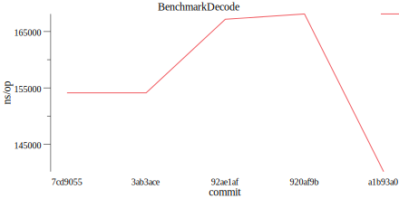

# benchdraw
[](https://circleci.com/gh/cep21/benchdraw)
[](https://godoc.org/github.com/cep21/benchdraw)
[](https://codecov.io/gh/cep21/benchdraw)

benchdraw allows you to make easy to read picture plots from data in Go's benchmark format.

# Usage

Run `make draw_examples` to see all the examples drawn.

## Simple example

Here we filter the benchmarks to just the ones named "BenchmarkTdigest_Add" and plot the tag "source" as our X
dimension.  The default Y dimension is ns/op.

```
./benchdraw --filter="BenchmarkTdigest_Add" --x=source < ./testdata/simpleres.txt > ./examples/out0.svg
```


## Reading from a file

You can run the same simple example another way, passing directly the input and output file names

```
./benchdraw --filter="BenchmarkTdigest_Add" --x=source --group="digest" --input=./testdata/simpleres.txt --output=./examples/out1.svg
```



## Plot another metric

You can set the "y" value to plot.  Here I set it to allocs/op

```
./benchdraw --filter="BenchmarkDecode/level=best" --x=size --y="allocs/op" --input=./testdata/decodeexample.txt --output=./examples/sample_allocs.svg
```



## Line output

Bar graphs are the default, but you can also output line charts.  This can help if the table at the top gets in the way.

```
./benchdraw --filter="BenchmarkDecode/level=best" --x=size --plot=line --y="allocs/op" --input=./testdata/decodeexample.txt --output=./examples/sample_line.svg
```



Here is another example line output

```
    ./benchdraw --filter="BenchmarkCorrectness/size=1000000/quant=0.000000" --x=source --plot=line --y=%correct --v=4 --input=./testdata/benchresult.txt --output=./examples/sample_line3.svg
```


## Custom metrics

You can also plot benchmark results of custom metrics.  Here I plot the custom metric %correct.

```
	./benchdraw --filter="BenchmarkCorrectness/size=1000000/digest=segmentio" --x=quant --y=%correct --v=4 --input=./testdata/benchresult.txt --output=./examples/segmentio_correct.svg
```


## Grouping

Sometimes your benchmarks have too many dimensions to read easily

```
	./benchdraw --filter="BenchmarkCorrectness/size=1000000" --x=quant --y=%correct --v=4 --input=./testdata/benchresult.txt --output=./examples/too_many.svg
```


You can group those bars.  By default, grouping aggregates with a mean(average) function.  Here I try to show, on average,
how correct two different implementations of the tdigest algorithm are as quantiles increase.

```
./benchdraw --filter="BenchmarkCorrectness/size=1000000" --x=quant --y=%correct --group="digest" --v=4 --input=./testdata/benchresult.txt --output=./examples/grouped.svg
```


## Using benchmark key/value tags
You can use the benchmark format's support for tagged data to chart changes over time.  Here is an example file.

```text
commit: 7cd9055
BenchmarkDecode/text=digits/level=speed/size=1e4-8   	     100	    154125 ns/op	  64.88 MB/s	   40418 B/op	       7 allocs/op
commit: 3ab3ace
BenchmarkDecode/text=digits/level=speed/size=1e4-8   	     100	    154125 ns/op	  64.88 MB/s	   40418 B/op	       7 allocs/op
commit: 92ae1af
BenchmarkDecode/text=digits/level=speed/size=1e4-8   	     100	    167185 ns/op	  64.88 MB/s	   40418 B/op	       7 allocs/op
commit: 920af9b
BenchmarkDecode/text=digits/level=speed/size=1e4-8   	     100	    168129 ns/op	  64.88 MB/s	   40418 B/op	       7 allocs/op
commit: a1b93a0
BenchmarkDecode/text=digits/level=speed/size=1e4-8   	     100	    140125 ns/op	  64.88 MB/s	   40418 B/op	       7 allocs/op
```

Notice how each benchmark run contains the tag "commit".  We can use commit as our x axis

```
./benchdraw --filter="BenchmarkDecode" --x=commit --plot=line --input=./testdata/encodeovertime.txt --output=./examples/comits.svg
```



# Parameter explainations

## x (required)
A x parameter should be a tag or dimension of your benchmark and will get distributed on the X axis of your image.

## y
A y parameter should be a unit of one of your benchmark runs  The default is "ns/op".

## filter
A filter limits which benchmarks we consider.  It is in a similar format to the expected benchmark output.  Each
`/` segment is a filter.  If the filter has `=`, then it is an exact match. If the filter has just a word, then it's
an existence match for that word.  For example `BenchmarkDecode/text=digits` matches

* `BenchmarkDecode/name=bob/text=digits`
* `BenchmarkDecode/text=digits`.

Does not match
* `BenchmarkDecode`
* `BenchmarkDecode/text=sawyer`

# Design Rational

The tool will never be as powerful as gnuplot.  My hope was to capture the most common cases.

# Contributing

Contributions welcome!  Submit a pull request on github and make sure your code passes `make lint test`.  For
large changes, I strongly recommend [creating an issue](https://github.com/cep21/benchdraw/issues) on GitHub first to
confirm your change will be accepted before writing a lot of code.  GitHub issues are also recommended, at your discretion,
for smaller changes or questions.

# License

This library is licensed under the Apache 2.0 License.